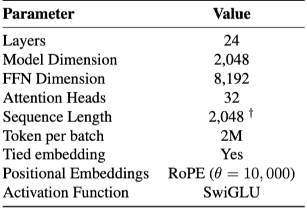

논문 출처:
[SmolLM2: When Smol Goes Big -- Data-Centric Training of a Small Language Model](https://huggingface.co/papers/2502.02737)

# Abstrct
- Large Language Model을 활용하는 데에 많은 계산 비용이 소요되고, 제한된 환경에서 배포가 어려운 문제가 있음
- 이 문제를 해결하기 위해 소형(17억 개의 매개변수) 언어 모델인 SmmolLM2의 개발 과정을 문서화하였음 
- 강력한 성능을 달성하기 위해 SmolLM2를 약 11조 개의 데이터 토큰으로 multi-stage process를 통해 훈련하였고, 이 과정에서 웹 텍스트, 특화된 수학과 코드, instruction-following data를 혼합사용하였음
- 또한, 이 과정에서 기존 데이터셋의 품질이 낮다고 판단하여 새로운 전문 데이터셋(Fine-Math, Stack-Edu, SmolTalk)을 추가적으로 소개함
- 궁극적으로, 저자들은 SmolLM2가 다른 최근 소형 언어모델(Llama3.2-1B, Qwen2.5-1.5B)과 벼교했을 때 우수한 성능을 보여준다는 것을 입증하고, 이 모델의 개발 과정에서 준비한 데이터셋을 본 논문에서 공개함

# Introduction
- 언어 모델의 크기에 관계 없이, 훈련하는데에 사용되는 데이터 관리가 성능을 좌우하므로 매우 중요하지만, 작은 모델의 경우에는 특히 데이터 품질이 성능에 더 큰 영향을 미친다
>  While important for an LM of any size, data curation has an especially outsized influence for smaller models, as their limited capacity must be carefully optimized for learning core knowledge and fundamental
capabilities rather than memorizing incidental fact

- 대부분 언어 모델은 주로 웹에서 크롤링한 텍스트로 훈련되고 데이터 품질을 향상시키기 위한 필터링 및 처리 단계 파이프라인을 사용하는데, 최근에는 software code, mathematics과 같은 특정 도메인에 전문화된 데이터를 포함하는 것이 일반화된 추세이다

- 이러한 사항들을 고려하여 본 논문으로 저자들이 기여하고자 하는 바는 다음과 같다:
    - 기존의 웹, 코드, 수학, instruction-folloinwg datasets를 신중하게 평가하여 훈련 데이터의 가이드를 돕고, 최종적으로 다양한 출처의 데이터를 multi-stage mnual rebalancing을 통해서 SmolLM2를 훈련하여 성능을 극대화한다
    - 표준적인 관행에 따라 SmolLM2의 instruction-tuned variant를 개발한다
    - 기존 데이터셋이 너무 작고 품질이 낮다는 것을 발견하여, 저자들은 새로운 데이터셋인 FineMath, Stack-Edu, 그리고 SmolTalk을 위한 새로운 데이터셋을 생성했다

# Pretraining datasets

- Pretraining 데이터 선별은 작은 언어모델에서 특히 중요한데, 이는 이들이 훈련 데이터의 노이즈에 더 민감한 경향이 있기 때문이다
- 또한, pretrining 전략을 설계하는 것은 데이터 선별 및 정제 뿐 아니라, 서로 다른 출처에서 얼마나 mix(i.e.샘플링)할지를 결정하는 것을 포함한다

## Ablation setup

- SmolLM2 룬련을 위한 데이터셋의 최적의 mixture(혼합)을 찾기 위해 [Penedo et al.(2024a)]('https://huggingface.co/papers/2406.17557')와 유사한 실증적 접근 방식을 따랐다
- 각 데이터셋에서 모델을 동일한 조건 하에(model configuration, training hyperparameters, token count) 훈련하였다
- Llama architecture에 기반한 1.7B parameter trnasformers 모델을 훈련함:
    - Sequqence length: 2048
    - Global batch size 사용: 약 200만개의 토큰을 포함
    - GPT2 tokenizer
    - Cosine learning rate schedule: lr 3.0 x $10^-4$
- 전체 데이터셋에서 무작위로 추출한 350B 토큰으로 학습되었다
- 평가를 위패 lighteval 사용, 평가 tasks: MMLU, OpenBook QA, PIQA, WinoGrande, ARC, Common-SenseQA
- 수학 및 코드 능력 평가는 일반적으로 광범위한 훈련 후에 발생하므로, SmolLM2 중간 훈련의 checkpoint에서부터 훈련을 시작함

## English web data
- Common Crawl의 web text: 대중적인 사전 학습 데이터 
- Classifier 기반의 필터링을 사용하는 두 가지 주요 open dataset: 
    - FineWeb-Edu: Llama3-70b-Instruct가 생성한 주석을 기반으로 훈련된 classifier애 의해 교육적이라고 판단된 1.3T 토큰으로 구성 
    - DCLM: OpenHermes2.5의 지침을 따르고 ELI5 subreddit의 고득점 게시물을 기반으로 clssifier를 사용하여 필터링된 3.8T 토큰으로 구성
- Fineweb=Edu와 DCLMDPTJ RKRRKR 350B 토큰을 사용하여 훈련된 모델의 성과 -> Table1에 나타나있음
- Table1: 
    - 교육 벤치마크 테스크인 MMLU, ARC, OpenBookQA에서 FineWeb-Edu로 훈련된 모델이 더 높은 점수를 기록하는 반면, 
    - DCLM으로 훈련된 모델은 HellaSwang과 CommonSenseQA에서 더 나은 성능을 보이고 있음
    - 이 결과를 데이터셋의 내용과 일치함: FineWeb-Edu는 교육자료를 우선시하고, DCLM은 보다 다양하고 대화적인 스타일을 포착함
    - 두 데이터의 상호 보완적인 강점을 고려하여 이들을 혼합하여 실험하였는데, 60%의 FineWeb-Edu와 40%의 DCLM혼합이 잘 작동한다는 것을 발견하였고, 표 1에 결과를 첨부하였음

## Math data
최근 연구에서는 Common Crawl에서 신중하게 선별된 수학적 콘텐츠와 targeted filtering techniques을 결합하면 언어 모델의 수학적 추론 능력을 크게 향상시킬 수 있음이 발표되었다

### Comparison of existing datasets
두 가지의 주요 수학 데이터셋을 비교
- OpenWebMath(OWM)
    - 12억 개의 토큰으로 구성
    - Common Crawl에서 수학 관련 콘텐츠를 필터링하고, 수학적 형식 및 방정식을 유지하기 위한 특수 텍스트 추출 파이프라인을 사용하여 구축
-InfiMM-WebMath
    - 40억 개의 토큰으로 구성
    - 데이터셋 저자들이 이것이 DeepSeekMath의 priviate dataset의 성능과 일치한다고 발표함

이 부분에서는 불충분한 데이터셋 크기와 단계별 수학적 추론에 대한 불충분한 집중, 그리고 고급 개념에 초점을 맞춘 학술 논문의 과도한 비율을 두 데이터셋의 한계로 강조한다. 

### New dataset: FineMath
FineMath 데이터셋은 추학적 추론과 과정을 중심으로 하는 최대 54B 토큰의 수학 데이터셋이다. 저자들은 Resiliparse를 사용해서 Common Crawl WARC 파일에서 텍스트를 추출하기 시작했고, FineWeb 데이터셋에 속한 5.8B 개의 고유 URL에 집중했다. 이후Llama-3.1-70B-Instruct 모델을 이용해서 FineWeb-Edu 필러링 접근 방식을 적용했다고 설명한다. 여기서 사용된 평가 프롬프트는 부록 C.2에 첨부되어 있다. 

저자들은 여러 버전의 FineMath를 제안한다: FineMath4+, FineMath3+,  Infi-WebMath4+,  Infi-WebMath3+
- Figure 1:
    - FineMath의 annealing ablations 분석 결과를 보여줌
    - 모든 FineMath 하위 세트는 GSM8K, MATH 및 MMLU-STEM에서 OWM 및 InfiMM-WebMath를 일관되게 월등한 성과를 기록
    - FineMath4+는 InfiMM-WebMath에 비해 GSM8K에서 2배, MATH에서 6배의 성과 향상을 달성하여, 추론을 포함한 고품질 수학 콘텐츠를 유지하는 것의 중요성을 보여줌

## Code data
- 언어 모델이 점점 더 코딩 보조 도구로 배포되고 있다
- 최근 연구에서는 사전 훈련에 코드 데이터를 포함하는 것이 코드 관련 능력 향상 뿐 아니라 자연어 추론과 세계 지식도 개선한다는 결과를 보였다 (Starck v1, StarCoderData, Stack v2, StarCoder2Data 등 포함)
- Stack-Edu:
    - 최근 연구 결과는 FineWeb-Edu Classifier 기반 필터링 전략이 코드 데이터에도 표과적일 수 있음을 보여줌
    - 따라서, 저자들은 StarCoder2Data의 필터링된 변형인 Stack-Edu를 구축
    - StarCoder2Data에서 15개 주요 프로그래밍 언어를 선택하여 더 작은 모델의 용량 제약에 맞추고, 실험을 위한 벤치마크 범위를 보장했음
    - 하위 집합은 약 4500억 토큰을 포함함
    - 이후, StarEncoder모델을 사용해 Llama3-70B-Instruct에서 생성된 합성 주석으로 15개 언어별 분류기를 훈련했으며, 교육적 품질을 0에서 5의 척도로 평가함

# Pretraining
최근 언어모델의 pre-training은 점점 더 긴 훈련 기간이 요구되고 있으며, 특히 작은 모델들에서 이러한 경향이 두드러진다. 더 긴 사전훈련 기간은 성능 향상과 추론 비용 감소에 영향을 미친다. 예를 들어, Qwen2-1.5B는 7조 개의 토큰으로, Qwen2.5-1.5B는 18조 개의 토큰으로, Llama3.2-1B는 9조 개의 토큰으로 훈련되었다. 
SmolLM2를 구축할 때는 수집한 데이터셋에서 약 두 번의 epoch에 해당하는 11조 개의 토큰으로 훈련을 하였고 사전훈련 동안 고정 데이터셋 혼합 대신 다단계 훈련 접근 방식을 사용했다. 

이 디자인은 네 가지 주요 원칙에 의해 가이드되었다:
    - 성능 기반 개입, 즉 주요 벤치마크에 대한 평가 지표를 모니터링하고 특정 능력 병목 현상을 해결하기 위해 데이터셋을 혼합 조정함
    - annealing phase동안 고품질의 수학 및 코드를 upsampling하여 FineMath와 Stack-Edu의 일부 데이터셋을 최종 단계에 반영하여 그 영향을 극대화함
    - 중간 규모 데이터셋인 OWM, InfiMM-WebMath 및 stack-Edu를 중간 훈련 과정에 전략적으로 도입하여 초기 대규모 데이터셋으로 인한 희석을 피함
    - 데이터의 과도한 반복을 피하며, Muennighoff et al.(2023)의 지침에 따라 대부분의 데이터셋에 대해 권장되는 4-5 epoch 임계값에 최대한 근접하도록 함

SmolLM2의 사전훈련비용(약 250,000$ GPU)을 고려하여 'Online' 접근 방식을 채택하였다. 
네 번의 사전 훈련 단계의 데이터 혼합은 Figure2에 제공되며, 일부 결정은 문헌에 확립된 발견에 기반하고 다른 결정은 훈련 중 수집된 경험적 통찰에 의해 유도되었다.

## Training setup
베이스 모델은 1.7B parameters의 LLama2 아키텍처를 따른다. nanotron 프레임워크를 사용하여 256개 H100으로 모델을 훈련했고, AdamW Optimizer를 사용하며 (β, β2) = (0.9, 0.95)인 Warmup Stable Decay (WSD) 학습률 스케줄을 적용하였다. 이 스케줄은 2,000 step의 워밍업 단계를 시작으로 유지했다. 

## Stable Phase: stage 1
## Stable Phase: stage 2
## Stable Phase: stage 3
## Decay hase: stage 4
## Context length extension
## Base model evaluation

# Post-training
기본 SmolLM2 모델 훈련 후, 성능과 유용성 극대화를 위해 표준 관행에 따라 instruction tuning과 preference learning을 시행하였다. post-training에는 기존 데이터셋을 사용했으며, SmolTalk라는 새로운 instruction tuning 데이터셋을 추가했다. 

## SmolTalk
SmolLM2 기본 모델은 1-2B 파라미터 범위의 다른 기본 모델들보다 우수한 성능을 보였지만, 공공 데이터 세트인 MagPi-Pro나 OpenHermes2.5에서 미세 조정한 후의 성능은 다른 모델들의 post-training 버전보다 낮았다. 이 관찰이 기존 데이터셋과 연구자들이 개발한 새로운 합성 데이터셋을 결합한 SmolTalk2개발의 동기를 부여했다. 여기는 Magpie-Ultra 대화 데이터 세트 및 Smol-Constraint, Smol-Rewrite, Smol-Summrization과 같은 특정 기능을 다루는 다른 전문 데이터 세트가 포함된다. 모든 데이터셋은 Distilabel을 사용하여 생성되었다.

## Supervised fine-tuning
Table9은 SmolTalk의 최종 구성을 보여준다. 2회에 걸쳐 SmolTalk에서 기본 SmolLM2의 supervised fine-tuning을 수행했고, global batch size는 128, sequence length는 8192, 학습률은 3.0 X 10^{-4}를 사용했다. 이 단계 이후의 평가 결과를 Table10에 나와있다. 

## Alignment
Preference learning을 위해 직접 선호 최적화(Direct Preference Optimization, DPO)를 사용했다. 다양한 공개 합성 피드백 데이터셋을 실험했고, 여기에는 UltraFeedback (Cui et al., 2024), UltraInteract (Yuan et al., 2024), Capybara (Daniele & Suphavadeeprasit, 2023), 그리고 ORCA (Lv et al., 2023)가 포함된다. UltraFeedback는 벤치마크 전반에서 가장 일관되게 효과적인 것으로 입증되었으며, MT-Bench, MMLU-Pro, 그리고 MATH를 향상시켰습니다. 우리는 학습률 1.0 × 10^{-6}, 베타 0.5, 전역 배치 크기 128, 그리고 시퀀스 길이 1024 토큰으로 2 epoch 동안 훈련했다. DPO 훈련의 마지막 단계 후, 저자들은 SmolLM2 모델을 얻었다. Dubey et al. (2024)에서 언급했듯이, DPO에 짧은 맥락 데이터를 사용하더라도 모델의 8k 맥락 능력에 영향이 없었음을 확인했다.

## Instruct model evaluation
SmolLM2의 최종 instruct 버전을 평가하고 이를 Qwen2.5-1.5B와 Llama3.2-1B의 지시 변형과 비교한 결과는 Table5에 나와있다. SmolLM2-Instruct는 강력한 지시 준수 능력을 보여주며, IFEval에서 Qwen2.5-1.5B-Instruct를 크게 능가한다. 논문에서 제안된 모델은 텍스트 재작성에 있어 MT-Bench 및 OpenRewrite-Eval에서 경쟁력을 갖추고 있으며, GSM8K 및 MATH 점수로 입증된 강력한 수학적 능력을 나타낸다. 이러한 결과는 SmolLM2가 다양한 과제를 일반화할 수 있는 능력을 강조하며, 유능한 채팅 보조 도구로서의 잠재력을 보여준다고 결론짓는다.

# SmolLM2 135B and 360M
SmolLM2-1.7B 외에 두 개의 소형 모델을 훈련했다: 
- SmolLM2-360M (360M 파라미터, 4T 토큰으로 훈련)
- SmolLM2-135M (135M 파라미터, 2T 토큰으로 훈련)

더 작은 용량과 감소된 훈련 비용을 감안하여, 가장 효과적인 데이터 혼합을 결정하기 위해 목표 훈련 길이에서 데이터 제거 작업을 다시 수행했다. FineWeb-Edu 분류기를 사용하여 DCLM을 필터링하고, 점수 0인 샘플을 제거하며, 점수 1 및 2인 샘플을 다운샘플링하는 것이 최선의 결과를 가져온다는 것을 발견했다. SmolLM2-1.7B와 달리, 여러 단계의 훈련 전략을 활용했던 반면, 이 소형 모델들은 일관된 고품질 데이터를 활용한 단일 단계 훈련 방식의 이점을 보았다. 우리는 초반부터 Stack-Edu를 포함시켰고, InfiMM-WebMath, FineMath, Cosmopedia와 함께 사용했다. 이 모델들은 SmolLM2-1.7B와 동일한 아키텍처를 공유하지만, Grouped Query Attention (GQA)을 사용하며, 20% 감소율과 3.0 × 10^{-3}의 학습률을 가진 WSD 스케줄러를 사용하여 훈련되었다. Post-training을 위해서는 필터링된 SmolTalk3 버전을 사용하여 복잡한 명령 수행 작업(예: 함수 호출)과 MagPie-Ultra의 어려운 예제를 제거하여 모델의 용량에 보다 잘 맞도록 조정했다. 마지막으로, UltraFeedback을 사용하여 DPO 훈련을 수행하여 명령 수행을 최적화하면서도 일관성과 유용성을 유지했다. SmolLM2-360M과 135M에 대한 자세한 내용은 각각의 모델 카드에서 확인할 수 있다.

# Conclusion
연구자들은 SmolLM2는 신중한 데이터셋 선별 및 다단계 훈련의 조합을 통해 개방형 소형 언어 모델의 최첨단을 발전시킨다고 서술한다. 제시한 접근법은 고품질 전문 데이터셋이 소형 모델이 다양한 기준에서 강력한 성능을 달성하는 데 중요한 역할을 한다는 점을 강조한다. FineMath, Stack-Edu, 그리고 SmolTalk의 개발은 기존의 공공 데이터셋의 한계를 해결하여 추론, 수학, 그리고 지시 따르기 작업에서의 능력을 향상시다. 향후 연구 및 개발을 지원하기 위해, 저자들은 훈련에 사용된 데이터셋과 코드를 함께 SmolLM2를 공개한다, 이러한 자원은 성능이 우수한 소형 언어 모델을 훈련하는 포괄적인 기초를 제공하여 더 넓은 범위의 연구자와 응용 프로그램이 접근할 수 있도록 한다.

